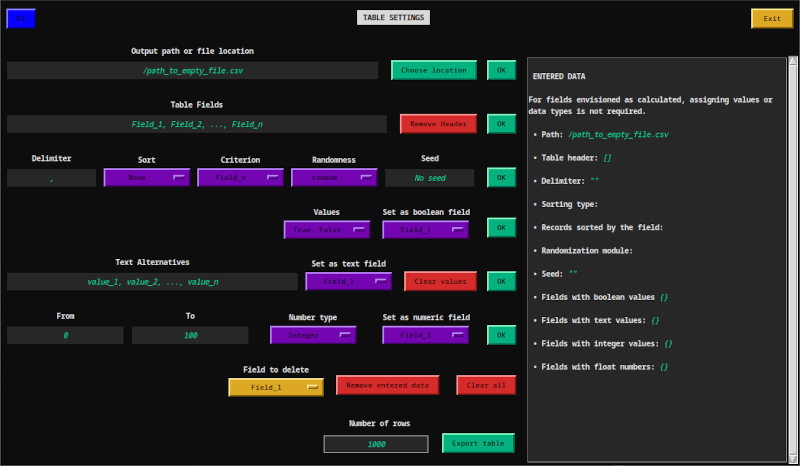

# GDA
GDA (*Generador de Datos Aleatorios*) es una interfaz gráfica que simplifica la creación de tablas con datos booleanos, de texto y numéricos de forma pseudoaleatoria. Utiliza las librerías estándar de Python *random* y *secrets*, para generar datos a partir de alternativas de texto, rangos y valores booleanos. La aplicación permite crear y exportar a un archivo CSV un conjunto de datos para su uso en pruebas, ejemplos o cualquier escenario que requiera información de prueba.

### Variante en español

### Variante en inglés

### Documentación
La documentación completa del proyecto esta disponible en este [enlace](https://errejotaeme.github.io/proyecto_tkinter/).

### Licencia

Este proyecto está bajo [Licencia MIT](LICENSE.txt).
